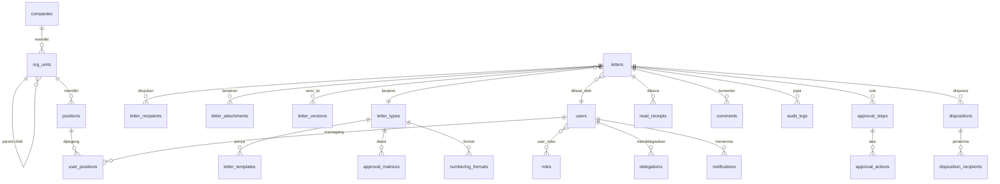

# eOffice Pro — Desain Skema Database
**Turunan dari:** [PRD-eOfficePro.md](../PRD-eOfficePro.md) · Target: PostgreSQL 15+ (rekomendasi; mendukung full-text search, JSONB untuk snapshot, transaksi kuat untuk penomoran).

## Prinsip Desain
1. **Jabatan ≠ Orang** — alur approval menunjuk `positions`; `users` hanya "pemegang jabatan saat ini" via `user_positions`. Mutasi pegawai tidak merusak surat.
2. **Snapshot** — surat menyimpan salinan JSONB rute approval & identitas penerima saat terbit, agar revisi struktur organisasi (Rev. 9 dst.) tidak mengubah arsip.
3. **Append-only audit** — `audit_logs` tidak pernah di-UPDATE/DELETE (enforce via permission DB + trigger).
4. **Soft state, hard history** — surat tidak dihapus; hanya berpindah status (`cancelled`, `archived`).
5. **Extensible** — `companies` sejak v1 (P2-4 multi-entitas), `letters.external_ref` disiapkan untuk surat eksternal (P2-1).

---

## ERD (Ringkas)



---

## 1. Organisasi & Pengguna

### `companies`
| Kolom | Tipe | Ket |
|-------|------|-----|
| id | uuid PK | |
| code | varchar(10) UQ | mis. `KSK` |
| name | varchar | PT Kalimantan Sawit Kusuma |
| letterhead_config | jsonb | kop: logo, alamat, font |
| is_active | bool | |

### `org_units`  *(pohon: Directorate → Biro → Department → Section → Division)*
| Kolom | Tipe | Ket |
|-------|------|-----|
| id | uuid PK | |
| company_id | uuid FK | |
| parent_id | uuid FK→org_units | NULL = root (kantor Presdir) |
| code | varchar(20) | dipakai penomoran, mis. `HRGA-HO` |
| name | varchar | |
| unit_level | enum | `directorate, biro, department, section, division, office` |
| region | enum NULL | `HO, REG1, REG2, REPO_JKT, REPO_PKB` |
| path | ltree/varchar | materialized path untuk query hierarki cepat |
| valid_from / valid_to | date | mendukung versi struktur (Rev. n) |
| is_active | bool | |

### `positions`
| Kolom | Tipe | Ket |
|-------|------|-----|
| id | uuid PK | |
| org_unit_id | uuid FK | |
| title | varchar | mis. "GM Biro HRGA", "Secretary Director F&A" |
| position_type | enum | `president_director, vp_director, director, gm, dept_head, section_head, division_head, assistant, secretary, staff, auditor` |
| reports_to | uuid FK→positions | rantai atasan → dasar resolusi rute approval |
| is_approver | bool | |

### `users`
| Kolom | Tipe | Ket |
|-------|------|-----|
| id | uuid PK | |
| nik | varchar UQ | nomor induk karyawan |
| email | varchar UQ | |
| full_name | varchar | |
| password_hash | varchar | argon2id |
| phone | varchar NULL | |
| signature_image_url | varchar NULL | specimen ttd (P1-7) |
| status | enum | `active, inactive, locked` |
| failed_login_count / locked_until | int / timestamptz | lockout |
| last_login_at | timestamptz | |
| external_ref | varchar NULL | ID HRIS (P2-3) |

### `user_positions`  *(dukung rangkap jabatan / Plt)*
| Kolom | Tipe | Ket |
|-------|------|-----|
| id | uuid PK | |
| user_id / position_id | uuid FK | UQ gabungan + periode |
| assignment_type | enum | `definitive, plt, plh` |
| valid_from / valid_to | date / NULL | |

### `roles`, `user_roles`
Role aplikasi: `admin, creator, approver, secretary, auditor`. Permission granular disimpan `roles.permissions jsonb` (v1 cukup; tabel permission terpisah bila kompleks).

### `delegations`
| Kolom | Tipe | Ket |
|-------|------|-----|
| id | uuid PK | |
| delegator_position_id | uuid FK | jabatan yang mendelegasikan |
| delegate_user_id | uuid FK | penerima wewenang |
| reason | varchar | cuti/dinas |
| valid_from / valid_to | timestamptz | otomatis aktif/berakhir |
| created_by | uuid FK | |

---

## 2. Master Surat

### `letter_types`
| Kolom | Tipe | Ket |
|-------|------|-----|
| id | uuid PK | |
| code | varchar(5) UQ | `ND, MI, SE, SK, SPT, UND, BA, SP` |
| name | varchar | Nota Dinas, Memo Internal, … |
| default_classification | enum | `biasa, terbatas, rahasia` |
| default_sla_hours | int | dasar reminder/eskalasi |
| is_active | bool | |

### `letter_templates`
| Kolom | Tipe | Ket |
|-------|------|-----|
| id | uuid PK | |
| letter_type_id / company_id | uuid FK | |
| version | int | template ber-versi |
| layout_config | jsonb | struktur kop, blok isi, posisi ttd & QR |
| body_skeleton | text | HTML awal composer |
| is_active | bool | satu aktif per jenis+perusahaan |

### `numbering_formats` & `numbering_counters`
```sql
numbering_formats(id, company_id, letter_type_id NULL, org_unit_id NULL,
                  pattern varchar,        -- '{seq:3}/{unit}/{type}/{roman_month}/{year}'
                  reset_period enum('yearly','monthly'), is_active bool)

numbering_counters(id, format_id FK, scope_key varchar,  -- mis. 'HRGA-HO|ND|2026'
                   current_value int, UNIQUE(format_id, scope_key))
-- Pengambilan nomor: SELECT ... FOR UPDATE dalam transaksi approval final (anti-duplikat).
```

### `approval_matrices`
| Kolom | Tipe | Ket |
|-------|------|-----|
| id | uuid PK | |
| letter_type_id | uuid FK | |
| originator_level | enum NULL | level pembuat (opsional pembeda) |
| final_level | enum | level tertinggi wajib, mis. `president_director` untuk SK |
| flow_mode | enum | `serial, parallel` |
| extra_steps | jsonb NULL | penambahan approver khusus (mis. Legal untuk SP) |

---

## 3. Surat & Siklus Hidup

### `letters`
| Kolom | Tipe | Ket |
|-------|------|-----|
| id | uuid PK | |
| company_id / letter_type_id | uuid FK | |
| letter_number | varchar NULL UQ | terisi saat approval final |
| subject | varchar(255) | perihal |
| classification | enum | `biasa, terbatas, rahasia` |
| priority | enum | `normal, urgent` |
| status | enum | `draft, submitted, in_approval, revision, approved, published, cancelled, archived` |
| creator_user_id / creator_position_id | uuid FK | jabatan saat membuat (snapshot ringan) |
| on_behalf_of_position_id | uuid NULL | mode sekretaris (a.n. pimpinan) |
| current_step_order | int NULL | posisi rute sekarang |
| route_snapshot | jsonb | salinan rute + nama pejabat saat terbit |
| org_snapshot_rev | varchar | mis. `REV-8` |
| final_pdf_url / qr_token | varchar | dokumen terbit + token verifikasi |
| refers_to_letter_id | uuid NULL | rujukan antar surat (P1-3) |
| external_ref | varchar NULL | cadangan surat eksternal (P2-1) |
| published_at / archived_at | timestamptz | |
| created_at / updated_at | timestamptz | |

**Index penting:** `(status, creator_user_id)`, `(letter_number)`, GIN full-text pada `subject + body` (via `letter_versions` terbaru), `(company_id, published_at)`.

### `letter_versions`  *(isi surat ber-versi; revisi tidak menimpa)*
| Kolom | Tipe |
|-------|------|
| id uuid PK · letter_id FK · version int · body_html text · body_plain text (untuk FTS) · edited_by uuid · created_at |

### `letter_recipients`
| Kolom | Tipe | Ket |
|-------|------|-----|
| id | uuid PK | |
| letter_id | uuid FK | |
| recipient_type | enum | `to, cc` |
| position_id / org_unit_id | uuid FK (salah satu) | penerima jabatan atau unit |
| resolved_user_id | uuid NULL | pemegang jabatan saat terbit (snapshot) |
| delivered_at | timestamptz | |

**Aturan lintas direktorat:** draft surat hanya boleh ditujukan lintas direktorat bila `creator_position_id.position_type` adalah `dept_head`, `gm`, `director`, `vp_director`, atau `president_director`. Target lintas direktorat harus berupa `position_id`; target `org_unit_id` lintas direktorat ditolak agar aturan level tidak dilewati lewat broadcast unit. Jika sisi pembuat atau penerima tidak berada di bawah unit level `directorate`, validasi lintas direktorat tidak diterapkan.

### `letter_attachments`
`id, letter_id, file_name, mime_type, size_bytes, storage_key, checksum_sha256, uploaded_by, created_at` — akses selalu via pre-signed URL + cek klasifikasi.

---

## 4. Approval, Disposisi, Jejak

### `approval_steps`  *(instance rute per surat)*
| Kolom | Tipe | Ket |
|-------|------|-----|
| id | uuid PK | |
| letter_id | uuid FK | |
| step_order | int | 1..n |
| approver_position_id | uuid FK | |
| flow_group | int | sama = paralel |
| status | enum | `pending, waiting, approved, rejected, skipped` |
| sla_deadline | timestamptz | dasar reminder/eskalasi |

### `approval_actions`
| Kolom | Tipe | Ket |
|-------|------|-----|
| id | uuid PK | |
| approval_step_id | uuid FK | |
| action | enum | `approve, reject, request_revision` |
| acted_by_user_id | uuid FK | bisa delegatee |
| on_behalf_delegation_id | uuid NULL | terisi bila "a.n." |
| note | text | wajib bila reject/revisi |
| device_info / ip_address | varchar | jejak perangkat |
| acted_at | timestamptz | |

### `dispositions` & `disposition_recipients`
```sql
dispositions(id, letter_id FK, parent_disposition_id NULL,  -- disposisi berantai
             from_position_id, instruction text, due_date, created_at)

disposition_recipients(id, disposition_id FK, position_id FK,
             status enum('open','in_progress','done'),
             followup_note text NULL, followup_attachment_key NULL,
             completed_at NULL)
```

### `read_receipts`
`id, letter_id, user_id, first_read_at, last_read_at, UNIQUE(letter_id, user_id)`

### `comments`
`id, letter_id, user_id, body, created_at` — diskusi internal, bukan bagian isi resmi.

### `notifications`
`id, user_id, event_type, letter_id NULL, title, body, channels jsonb('inapp','push','email'), read_at NULL, created_at`
+ `notification_preferences(user_id, event_type, channels jsonb)`.

### `audit_logs`  *(append-only)*
| Kolom | Tipe | Ket |
|-------|------|-----|
| id | bigserial PK | |
| entity_type / entity_id | varchar / uuid | umumnya `letter` |
| action | varchar | `create, update, submit, approve, reject, read, download, export, login, delegate, …` |
| actor_user_id | uuid NULL | NULL = sistem |
| detail | jsonb | diff/parameter |
| ip_address / user_agent | varchar | |
| created_at | timestamptz | |

```sql
REVOKE UPDATE, DELETE ON audit_logs FROM app_user;
-- opsional: hash-chain (kolom prev_hash) untuk bukti tamper-evident bagi Inspectorate
```

---

## 5. Kueri Kritis & Catatan Implementasi

**Resolusi rute approval** — telusuri `positions.reports_to` dari jabatan pembuat ke atas hingga `approval_matrices.final_level`; sisipkan `extra_steps`; materialisasi ke `approval_steps` saat submit (bukan on-the-fly) agar deterministik.

**Antrian "Menunggu Aksi Saya"** —
```sql
SELECT l.* FROM letters l
JOIN approval_steps s ON s.letter_id = l.id AND s.status = 'waiting'
JOIN user_positions up ON up.position_id = s.approver_position_id
  AND up.user_id = :me AND now()::date BETWEEN up.valid_from AND COALESCE(up.valid_to,'9999-12-31')
UNION  -- + surat dari delegasi aktif
SELECT l.* FROM letters l
JOIN approval_steps s ON s.letter_id = l.id AND s.status='waiting'
JOIN delegations d ON d.delegator_position_id = s.approver_position_id
  AND d.delegate_user_id = :me AND now() BETWEEN d.valid_from AND d.valid_to;
```

**Full-text search** — kolom `tsvector` generated dari `subject + body_plain versi terbaru + letter_number`, GIN index; konfigurasi `indonesian` (atau `simple` + unaccent). Target < 3 dtk @100k surat mudah tercapai.

**Penomoran anti-duplikat** — dalam satu transaksi approval final: `SELECT current_value FROM numbering_counters WHERE ... FOR UPDATE` → increment → format → tulis `letters.letter_number`. Gagal render PDF ⇒ rollback seluruh transaksi (nomor tidak hangus).

**Offline queue Android** — aksi approve/reject membawa `client_action_id uuid` unik; server idempotent (UNIQUE pada `approval_actions.client_action_id`) agar retry ganda tidak menghasilkan aksi ganda.

**Retensi** — job terjadwal menandai `letters.archived_at`; tidak ada hard delete (PRD P0-7).
